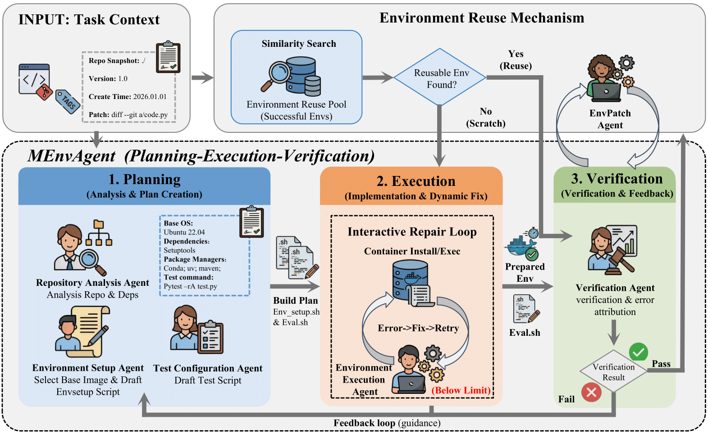
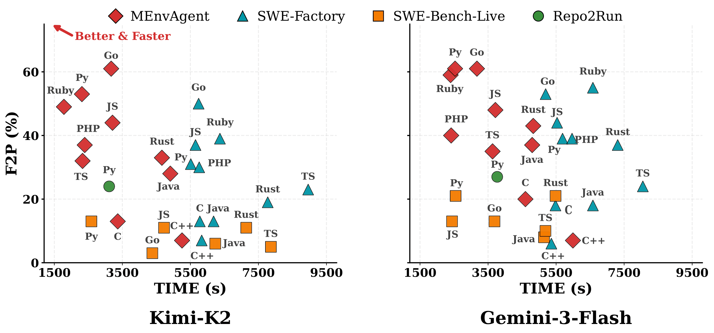

# MEnvAgent


<p align="center">
  <a href="https://arxiv.org/abs/2601.22859"></a>
  <a href="https://opensource.org/licenses/Apache-2.0"></a>
</p>
<p align="center">
  <a href="https://huggingface.co/datasets/ernie-research/MEnvBench"></a>
  <a href="https://huggingface.co/datasets/ernie-research/MEnvData-SWE"></a>
  <a href="https://huggingface.co/datasets/ernie-research/MEnvData-SWE-Trajectory"></a>
</p>

**MEnvAgent: Scalable Polyglot Environment Construction for Verifiable Software Engineering**

Official implementation of MEnvAgent, an automated framework for constructing executable environments across 10 programming languages to enable scalable generation of verifiable software engineering data.


## 📰 News

* Stay tuned for future updates.
* **[Jan. 2026]**: We release MEnvData-SWE, the largest open-source polyglot dataset of realistic verifiable Docker environments to date, comprising **3,005 task instances** from **942 repositories** across **10 programming languages**, with **3,872 agent trajectories**.
* **[Jan. 2026]**: MEnvBench is now available - an execution-based environment construction benchmark with rigorous quality assurance, covering **1,000 tasks** across **10 programming languages** from diverse domains.

## ⭐ Key Features

- **Multi-Language Support**: Automated environment construction for 10 mainstream programming languages (Python, Java, TypeScript, JavaScript, Rust, Go, C++, Ruby, PHP, C)
- **Multi-Agent Architecture**: Planning-Execution-Verification closed-loop system with specialized agents for different tasks
- **Environment Reuse Mechanism**: Novel approach that reduces overhead by incrementally patching retrieved environments instead of building from scratch
- **Docker/Kubernetes Backend**: Flexible container orchestration supporting both Docker and Kubernetes (K8s backend enables thousand-scale concurrent environment construction)
- **Fail2Pass Validation**: Rigorous validation ensuring tests fail before fix and pass after applying patches
- **High Performance**: Achieves 8.6% improvement in F2P rates while reducing time costs by 43% compared to baselines

## 🏗️ Architecture Overview

MEnvAgent employs a multi-agent system structured into three iterative stages:

<p align="center">
  
</p>
<p align="center">
  <em>Overview of MEnvAgent: (Top) Environment Reuse Mechanism retrieves and adapts historical environments. (Bottom) Planning-Execution-Verification loop with autonomous agents.</em>
</p>

### 📝 Planning Stage
- **Repository Analysis Agent**: Explores repository structure and generates comprehensive summary
- **Environment Setup Agent**: Determines suitable base image and generates installation scripts
- **Test Configuration Agent**: Synthesizes compatible test configuration scripts

### ⚡ Execution Stage
- **Environment Execution Agent**: Instantiates containers and executes build commands with real-time monitoring
- Dynamic error resolution and automatic retry mechanisms

### ✅ Verification Stage
- **Verification Agent**: Executes tests and performs error attribution
- Iterative refinement loop with diagnostic feedback to planning stage

### ♻️ Environment Reuse Mechanism
Instead of building environments from scratch, MEnvAgent:
1. Retrieves similar historical environments from the Environment Pool
2. Uses **EnvPatchAgent** to generate incremental patches
3. Applies patches to adapt the retrieved environment to target requirements
4. Significantly reduces computational overhead and improves success rates

## 📋 Prerequisites

- Python 3.10+
- Docker (version 27.0.3+ recommended)
- Kubernetes (optional, for K8s backend)
- Git

## 📊 MEnvBench: Environment Construction Benchmark

MEnvBench is a comprehensive benchmark for evaluating multi-language environment building and test execution, comprising **1,000 tasks** (10 languages × 20 repositories × 5 instances) selected from 200 high-quality open-source repositories.

* **Quality Assurance**: Multi-stage filtering pipeline yielding 8,000 high-quality candidate repositories (>1,000 stars, >200 forks/issues/PRs) and 213,766 Issue-PR pairs after initial quality screening, followed by strict criteria including closed issues with test patches and LLM-based quality assessment.
* **Repository Selection**: Strategic sampling considering domain diversity (AI, System, Web, etc.) and difficulty levels (five project scale bands from <10MB to >500MB) to ensure broad coverage across diverse software ecosystems.


### 📈 Evaluation Results

We evaluate performance across two critical dimensions: success rate and efficiency. As shown in the visualizations below, **MEnvAgent consistently occupies the top-left corner, achieving the best balance of being both faster and more accurate ("better & faster").**

|  |  |
| :---: | :---: |
| **Fail-to-Pass (F2P) vs. Time** | **Pass Rate vs. Time** |

### 🎯 Key Improvements

Compared to state-of-the-art baselines, MEnvAgent delivers:
* **🚀 8.6% Increase** in Fail-to-Pass (F2P) rates.
* **⏱️ 43% Reduction** in total time costs.
* **🌐 Polyglot Stability**: Consistent performance gains across all 10 supported programming languages.

### Dataset Structure

| Field | Type | Description |
| :--- | :--- | :--- |
| **repo** | `str` | The full GitHub repository name (e.g., "home-assistant/core"). |
| **pull_number** | `int` | The pull request number associated with the fix (e.g., 807). |
| **instance_id** | `str` | A unique identifier for the task instance (e.g., "home-assistant__core-807"). |
| **issue_numbers** | `list` | A list of linked issue numbers (e.g., [103876]). |
| **base_commit** | `str` | The commit SHA of the repository prior to the fix. |
| **version** | `str` | The version of the dataset (e.g., "0.10"). |
| **patch** | `str` | The ground-truth patch (git diff) that resolves the issue. |
| **test_patch** | `str` | The test patch (git diff) containing new tests to reproduce the issue. |
| **problem_statement** | `str` | The natural language description of the issue. |
| **hints_text** | `str` | Hints extracted from the issue discussion to aid resolution. |
| **all_hints_text** | `str` | Comprehensive context including all comments and code review details. |
| **commit_urls** | `list` | A list of URLs pointing to the relevant commits. |
| **created_at** | `str` | The creation timestamp (e.g., "2015-12-27T19:33:55Z"). |
| **language** | `str` | The programming language of the repository (e.g., "Python"). |
---

## 💾 MEnvData Dataset

We release **MEnvData**, a high-quality polyglot SWE dataset comprising **3,005 task instances** from **942 repositories** across **10 programming languages**:

- **3,005 Docker Images**: Pre-built environment images with verified dependencies.
- **3,872 Agent Trajectories**: Complete execution trajectories for training and fine-tuning, collected using [OpenHands](https://github.com/All-Hands-AI/OpenHands) agent scaffolding with Claude Sonnet 4.5 model.
- **Universal Format**: Fully compatible with **SWE-factory** format.
- **Efficient Verification**: Validation is based on concise **exit codes** (Success/Failure), eliminating the need for complex `log_parser` logic.
- **Verified Quality**: Each instance includes a fully executable environment with pre-verified test cases.

### 🔗 Dataset Access

🤗 **Hugging Face Dataset**: [https://huggingface.co/datasets/ernie-research/MEnvData-SWE](https://huggingface.co/datasets/ernie-research/MEnvData-SWE)

```python
# Load the dataset using Hugging Face
from datasets import load_dataset
# MEnvData-SWE
dataset = load_dataset("ernie-research/MEnvData-SWE")
# MEnvData-SWE-Trajectory
dataset = load_dataset("ernie-research/MEnvData-SWE-Trajectory")
```

### 📋 Dataset Structure


MEnvData-SWE extends the standard schema with **executable environment configurations**. Each instance contains the following fields:

| Field | Type | Description |
| :--- | :--- | :--- |
| **repo** | `str` | The full GitHub repository name (e.g., "home-assistant/core"). |
| **pull_number** | `int` | The pull request number associated with the fix. |
| **instance_id** | `str` | A unique identifier for the task instance. |
| **issue_numbers** | `list` | A list of linked issue numbers. |
| **base_commit** | `str` | The commit SHA of the repository prior to the fix. |
| **version** | `str` | The version of the dataset. |
| **patch** | `str` | The ground-truth patch (git diff) that resolves the issue. |
| **test_patch** | `str` | The test patch (git diff) containing new tests to reproduce the issue. |
| **problem_statement** | `str` | The natural language description of the issue. |
| **hints_text** | `str` | Hints extracted from the issue discussion. |
| **all_hints_text** | `str` | Comprehensive context including all comments and reviews. |
| **commit_urls** | `list` | A list of URLs pointing to the relevant commits. |
| **created_at** | `str` |  The creation timestamp (e.g., "2015-12-27T19:33:55Z"). |
| **language** | `str` | The programming language (e.g., "Python"). |
| **env_setup_script** | `str` |  Incremental bash commands used to configure the environment (for reuse scenarios). |
| **original_env_setup_script** | `str` | The foundational setup commands. Represents the reused base image's setup or the full build script if built from scratch. |
| **eval_script** | `str` |  The complete verification script that applies the `test_patch` and executes the test commands. |
| **image_name** | `str` |  The specific Docker image name/tag available for this instance. |

> **Note**: We are actively expanding MEnvData-SWE with additional repositories and task instances. Stay tuned for potential future releases.

## 🔧 Installation

### 1. Clone the Repository

```bash
git clone https://github.com/your-org/MEnvAgent.git
cd MEnvAgent
```

### 2. Set Up Python Environment

```bash
conda create --name menvagent python=3.10 -y
conda activate menvagent
pip install -r requirements.txt
```

### 3. Configure Environment Variables

```bash
# Set your LLM API configuration
export OPENAI_API_BASE_URL=<your_base_url>
export OPENAI_KEY=<your_api_key>

# (Optional) Configure proxy settings if needed
export http_proxy="http://your-proxy:port"
export https_proxy="http://your-proxy:port"
export no_proxy="localhost,127.0.0.1"
```

## 📖 Citation

If MEnvAgent helps your research or projects, please cite our paper:

```bibtex
@misc{guo2026menvagent,
      title={MEnvAgent: Scalable Polyglot Environment Construction for Verifiable Software Engineering}, 
      author={Chuanzhe Guo and Jingjing Wu and Sijun He and Yang Chen and Zhaoqi Kuang and Shilong Fan and Bingjin Chen and Siqi Bao and Jing Liu and Hua Wu and Qingfu Zhu and Wanxiang Che and Haifeng Wang},
      year={2026},
      url={https://arxiv.org/abs/2601.22859}, 
}
```

## 🙏 Acknowledgements

MEnvAgent builds upon foundational work in software engineering and LLM agents:
- **[SWE-Bench-Live](https://github.com/microsoft/SWE-bench-Live)**: A dynamic, continuously-updated benchmark for evaluating language models on real-world software tasks with fresh, uncontaminated GitHub issues
- **[SWE-Factory](https://arxiv.org/abs/2506.10954)**: Automated factory for GitHub Issue Resolution Training Data and Evaluation Benchmarks.

## 📜 License

This project is licensed under the Apache License 2.0 - see the [LICENSE](LICENSE) file for details.

## 📧 Contact

For questions, issues, or collaborations, please:
- Open an issue on GitHub
- Contact: czguo@ir.hit.edu.cn

---
