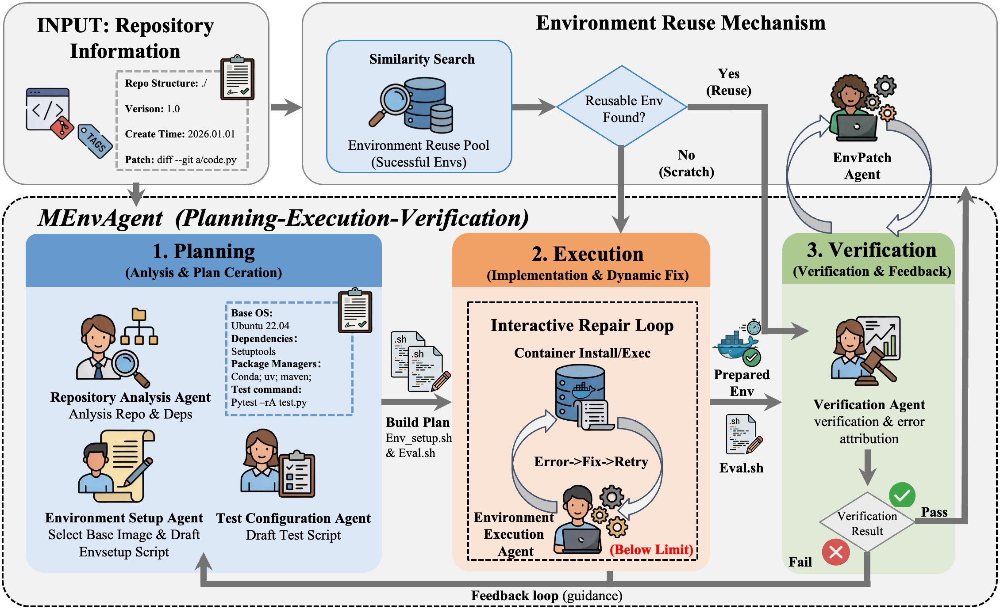

# MEnvAgent

<!-- <p align="center">
  <a href="#"></a>
  <a href="https://opensource.org/licenses/Apache-2.0"></a>
  <a href="https://www.python.org/"></a>
</p> -->

<p align="center">
  <a href="https://arxiv.org/abs/XXXX.XXXXX"></a>
  <a href="https://huggingface.co/datasets/TODO/MEnvData-SWE-2K"></a>
  <a href="https://opensource.org/licenses/Apache-2.0"></a>
</p>

**MEnvAgent: Scalable Polyglot Environment Construction for Verifiable Software Engineering**

Official implementation of MEnvAgent, an automated framework for building executable environments across 10 programming languages to enable scalable generation of verifiable software engineering data.

<!-- TODO: Convert PDF to SVG before release (recommended) or PNG
<p align="center">
  
</p>
<p align="center">
  <em>Comparison between manual environment construction and MEnvAgent's automated approach</em>
</p>
-->

## 📰 News

<!-- * **[Jan. 2026]**: Our paper "MEnvAgent: Scalable Polyglot Environment Construction for Verifiable Software Engineering" has been submitted to ! -->
* **[Jan. 2026]**: We release MEnvData-SWE-2K, a high-quality polyglot SWE dataset with verified executable environments and agent trajectories.
* **[Jan. 2026]**: MEnvBench is now available - a comprehensive benchmark covering 1,000 tasks across 10 mainstream programming languages.

## ⭐ Key Features

- **Multi-Language Support**: Automated environment construction for 10 mainstream programming languages (Python, Java, TypeScript, JavaScript, Rust, Go, C++, Ruby, PHP, C)
- **Multi-Agent Architecture**: Planning-Execution-Verification closed-loop system with specialized agents for different tasks
- **Environment Reuse Mechanism**: Novel approach that reduces overhead by incrementally patching retrieved environments instead of building from scratch
- **Docker/Kubernetes Backend**: Flexible container orchestration supporting both Docker and Kubernetes
- **Fail2Pass Validation**: Rigorous validation ensuring tests fail before fix and pass after applying patches
- **High Performance**: Achieves 8.6% improvement in F2P rates while reducing time costs by 43% compared to baselines

## 🏗️ Architecture Overview

MEnvAgent employs a multi-agent system structured into three iterative stages:

<p align="center">
  
</p>
<p align="center">
  <em>Overview of MEnvAgent: (Top) Environment Reuse Mechanism retrieves and adapts historical environments. (Bottom) Planning-Execution-Verification loop with autonomous agents.</em>
</p>

### 📝 Planning Stage
- **Repository Analysis Agent**: Explores repository structure and generates comprehensive summary
- **Environment Setup Agent**: Determines suitable base image and generates installation scripts
- **Test Configuration Agent**: Synthesizes compatible test configuration scripts

### ⚡ Execution Stage
- **Environment Execution Agent**: Instantiates containers and executes build commands with real-time monitoring
- Dynamic error resolution and automatic retry mechanisms

### ✅ Verification Stage
- **Verification Agent**: Executes tests and performs error attribution
- Iterative refinement loop with diagnostic feedback to planning stage

### ♻️ Environment Reuse Mechanism
Instead of building environments from scratch, MEnvAgent:
1. Retrieves similar historical environments from the Environment Pool
2. Uses **EnvPatchAgent** to generate incremental patches
3. Applies patches to adapt the retrieved environment to target requirements
4. Significantly reduces computational overhead and improves success rates

## 📋 Prerequisites

- Python 3.10+
- Docker (version 27.0.3+ recommended)
- Kubernetes (optional, for K8s backend)
- Git

## 🔧 Installation

### 1. Clone the Repository

```bash
git clone https://github.com/your-org/MEnvAgent.git
cd MEnvAgent
```

### 2. Set Up Python Environment

```bash
conda create --name menvagent python=3.10 -y
conda activate menvagent
pip install -r requirements.txt
```

### 3. Configure Environment Variables

```bash
# Set your LLM API configuration
export OPENAI_API_BASE_URL=<your_base_url>
export OPENAI_KEY=<your_api_key>

# (Optional) Configure proxy settings if needed
export http_proxy="http://your-proxy:port"
export https_proxy="http://your-proxy:port"
export no_proxy="localhost,127.0.0.1"
```

## 🚀 Quick Start

*[Coming soon - code startup instructions will be provided after code organization]*

### Basic Usage

```bash
# TODO: Add basic usage examples once code is organized
```

### Running on SWE-Bench Tasks

```bash
# TODO: Add SWE-Bench execution examples
```

### Building Environments from GitHub Issues

```bash
# TODO: Add GitHub issue processing examples
```

## 📊 MEnvBench: Evaluation Benchmark

MEnvBench is a comprehensive benchmark for evaluating multi-language environment building and test execution:

- **Coverage**: 1,000 tasks across 10 mainstream programming languages
- **Repositories**: 200 diverse open-source repositories
- **Diversity**: Multi-dimensional sampling ensuring high coverage across domains, popularity, and complexity

### 📈 Evaluation Results

Performance comparison with state-of-the-art baselines:

| Model | F2P Rate (%) | Time (min) | Cost (USD) |
|-------|--------------|------------|------------|
| **MEnvAgent** | **TBD** | **TBD** | **TBD** |
| Baseline-1 | TBD | TBD | TBD |
| Baseline-2 | TBD | TBD | TBD |

*Note: Detailed results will be added from paper*

### 🎯 Key Improvements
- **8.6%** improvement in Fail-to-Pass (F2P) rates
- **43%** reduction in time costs
- Consistent performance across all 10 supported languages

## 💾 MEnvData-SWE-2K Dataset

We release **MEnvData-SWE-2K**, a high-quality dataset for software engineering research:

- **Size**: 2,000+ verified task instances
- **Languages**: Multi-language coverage (Python, Java, and more)
- **Quality**: All instances include verified executable environments
- **Trajectories**: Agent execution trajectories for training and analysis
- **Format**: Compatible with SWE-Bench evaluation framework

### 🔗 Dataset Access

🤗 **Hugging Face Dataset**: [https://huggingface.co/datasets/TODO/MEnvData-SWE-2K](https://huggingface.co/datasets/TODO/MEnvData-SWE-2K)

```python
# Load the dataset using Hugging Face datasets library
from datasets import load_dataset

dataset = load_dataset("TODO/MEnvData-SWE-2K")
```

### 📋 Dataset Structure

Each instance contains:
- Repository information (org, repo, commit)
- Test patches and fix patches
- Docker base image configurations
- Verified test execution scripts
- Agent interaction trajectories

*Note: Dataset will be publicly released upon paper publication*

## 💻 Supported Languages and Base Images

MEnvAgent supports the following languages with pre-built base images:

### 🐍 Python
- Versions: 3.6, 3.7, 3.8, 3.9, 3.10, 3.11, 3.12, 3.13
- Standard images: `swe-images-base:agentic-py<version>`
- Claude Code enabled: `swe-images-base:agentic-cc-py<version>` (3.10-3.13)

### ☕ Java
- Versions: 8, 11, 17
- Images: `swe-images-base:agentic-java<version>`
- Includes: Maven 3.9.6 and Gradle 8.5

### 🌍 Other Languages
- TypeScript/JavaScript: Node.js environments
- Rust: Rust toolchain with cargo
- Go: Go compiler and tools
- C++: GCC/Clang compiler suites
- Ruby: Ruby interpreter with bundler
- PHP: PHP runtime with composer
- C: GCC Compiler

## 📁 Project Structure

```
MEnvAgent/
├── app/                          # Main application code
│   ├── main.py                   # Main entry point
│   ├── runtime_async.py          # Async runtime manager (Docker/K8s)
│   ├── agents/                   # Specialized agent implementations
│   │   ├── baseimage_select_agent/    # Base image selection
│   │   ├── env_patch_agent/           # Environment patching
│   │   ├── test_analysis_agent/       # Test analysis
│   │   ├── write_eval_script_agent/   # Evaluation script generation
│   │   └── train_env_gen_agent/       # Training environment generation
│   └── ...
├── build_repo.py                 # Repository builder orchestration
├── cc.py                         # Claude Code SDK integration
├── evaluation/                   # Evaluation framework
│   ├── run_evaluation.py         # Main evaluation script
│   └── ...
├── data_collection/              # Data collection tools
│   └── collect/                  # GitHub data collection
├── dockerfile/                   # Docker image definitions
├── data/                         # Input datasets and tasks
└── playground/                   # Working directory for outputs

```

## 🔬 Advanced Usage

### Building Custom Base Images

```bash
# Build Python images
make build_py313
make build_py312

# Build Java images
make build_java17
make build_java11
```

### Running Fail2Pass Validation

```bash
python evaluation/run_evaluation.py \
  --dataset_name "output/results.json" \
  --predictions_path "gold" \
  --max_workers 5 \
  --run_id "fail2pass_check" \
  --output_path "run_instances" \
  --timeout 3600 \
  --is_judge_fail2pass
```

### Customizing Agent Behavior

Agents are located in `app/agents/`. Each agent can be customized by:
1. Modifying agent prompts and logic
2. Adjusting retry strategies and timeouts
3. Extending tool capabilities

## ⚙️ Configuration

### Backend Selection

```python
# Docker backend
runtime = await Runtime.create(backend="docker", docker_image="ubuntu:latest")

# Kubernetes backend
runtime = await Runtime.create(backend="kubernetes", docker_image="image:tag")
```

### LLM Configuration

Configure your preferred LLM model:
- Default model: `claude-sonnet-4-5-20250929`
- Supported: GPT-4, Claude, Gemini, Kimi-k2, and more
- Configure via environment variables or config files

## 🤝 Contributing

We welcome contributions to improve MEnvAgent! Areas for potential improvements:

1. **Additional Language Support**: Extend to more programming languages
2. **Agent Optimization**: Improve agent reasoning and error handling
3. **Environment Reuse**: Enhance similarity matching algorithms
4. **Evaluation Metrics**: Add new metrics for environment quality assessment

To contribute:
1. Fork the repository
2. Create your feature branch (`git checkout -b feature/amazing-feature`)
3. Commit your changes (`git commit -m 'Add some amazing feature'`)
4. Push to the branch (`git push origin feature/amazing-feature`)
5. Open a Pull Request

## 📖 Citation

If MEnvAgent helps your research or projects, please cite our paper:

```bibtex
@article{menvagent2026,
  title={MEnvAgent: Scalable Polyglot Environment Construction for Verifiable Software Engineering},
  author={TODO: Add authors from paper},
  journal={International Conference on Machine Learning (ICML)},
  year={2026}
}
```

## 🙏 Acknowledgements

MEnvAgent builds upon foundational work in software engineering and LLM agents:

- **[SWE-bench](https://arxiv.org/abs/2310.06770)**: Pioneering benchmark for evaluating language models on real-world software tasks
- **[Repo2Run](https://arxiv.org/abs/2502.13681)**: Automated building of executable environments at scale
- **[SWE-Factory](https://arxiv.org/abs/2506.10954)**: Automated factory for issue resolution training data

We are grateful to the open-source community for their invaluable contributions to software engineering research.

## 📜 License

This project is licensed under the Apache License 2.0 - see the [LICENSE](LICENSE) file for details.

## 📧 Contact

For questions, issues, or collaborations, please:
- Open an issue on GitHub
- Contact: [TODO: Add contact email]

---

**Note**: This is an official research project. The codebase is currently being organized for public release. Full documentation and examples will be provided soon.
